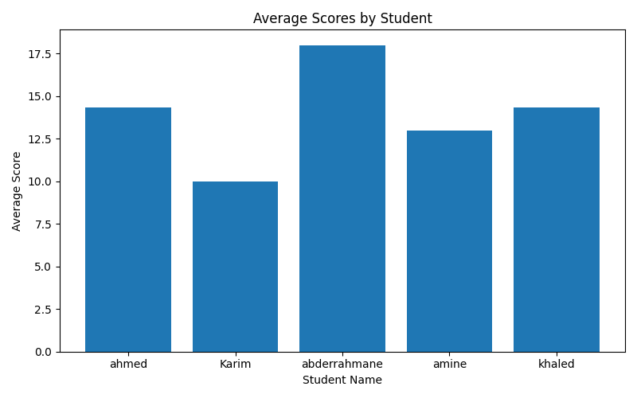
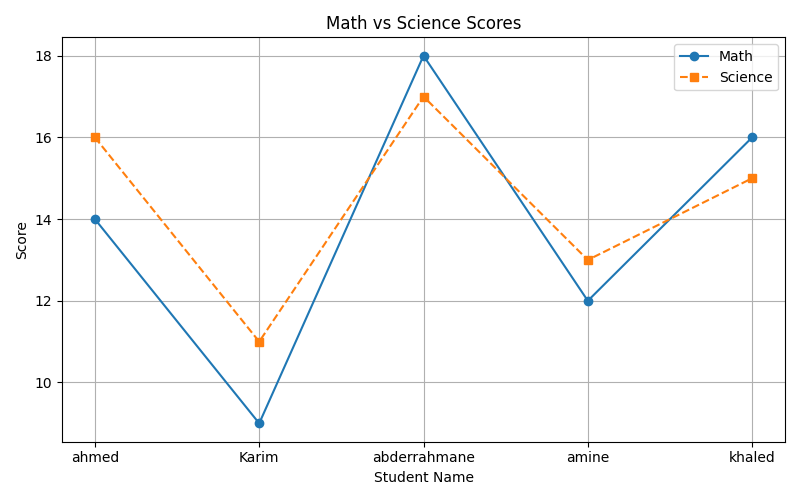
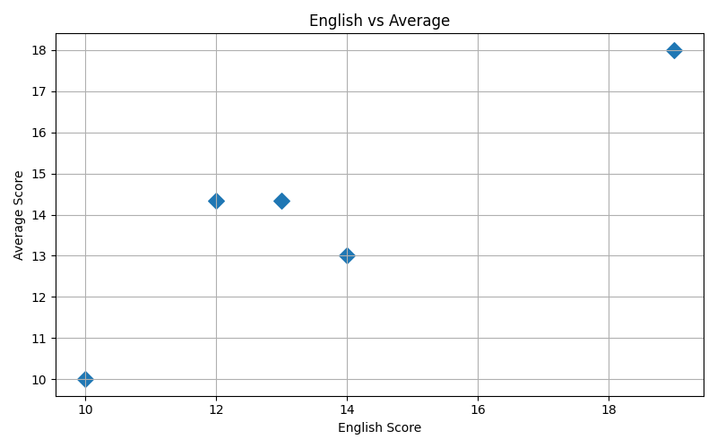

# Student Performance Analysis

## Overview

This project demonstrates basic data analysis using Python, Pandas, and Matplotlib.

The application creates a dataset of students, calculates average scores, performs statistical analysis, filters data, exports results to CSV files, and generates visual reports.

## Features

* Create and manipulate DataFrames
* Calculate student averages
* Filter students based on conditions
* Generate descriptive statistics
* Sort records by performance
* Combine multiple DataFrames
* Export results to CSV
* Generate charts using Matplotlib

## Technologies

* Python
* Pandas
* Matplotlib

## Generated Outputs

* students.csv
  [Download CSV](outputs/students.csv)
* merged_concat.csv
  [Download CSV](outputs/merged_concat.csv)
* average_scores.png
  
  
* math_vs_science.png
  
  
* english_vs_average.png
  
  

## Learning Objectives

This project was developed to practice:

* Data manipulation with Pandas
* Statistical analysis
* Data visualization
* File export operations

## Author

Abderrahmane Imlouli
